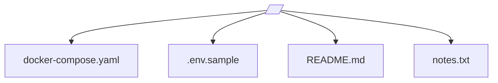
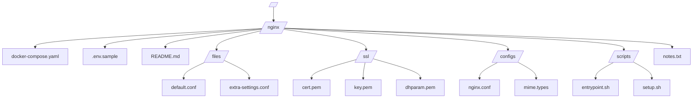

# The Archive of the Unsung — Shelved Resources

A place for all the things you've built, tuned, configured — and then moved on from. This repository is a carefully structured time capsule for **unused, paused, or decommissioned services**, ensuring their resources are never truly lost.

Much like a library stores retired manuscripts or a museum preserves tools of a bygone era, this repo safeguards Docker Compose files, configuration templates, service-specific data, and custom scripts from being deleted or forgotten — even if they’re not part of your current stack.

> 🔒 _This is the place where “delete” is replaced by “archive.”_

---

## 📑 Table of Contents 

- [What This Repository Is](#what-this-repository-is)
- [Philosophy: "Nothing Gets Deleted, Only Shelved"](#philosophy-nothing-gets-deleted-only-shelved)
- [Key Benefits](#key-benefits)
- [Repository Layout](#repository-layout)
  - [main Branch](#main-branch)
  - [Orphan Branches](#orphan-branches)
- [Best Practices for Shelving](#best-practices-for-shelving)
- [Tips](#tips)
- [FAQ](#faq)
- [Final Words](#final-words)

---

## What This Repository Is 

- A **centralized archive** for unused services, settings, and system files.
- A **clean workspace** to preserve prior work without cluttering active codebases.
- A **structured resource vault** — nothing in-use, everything still valuable.
- A place to **look back**, reuse, reference, or resurrect projects as needed.

Each orphan branch is a standalone snapshot of a specific project or service that was once useful and may be again.

---

## Philosophy: "Nothing Gets Deleted, Only Shelved" 

This repository is not where active development occurs. Instead, it's a **persistent memory layer** — storing what’s been put on hold, migrated away from, or rewritten.

Unlike conventional repositories, there’s no shared history between branches. Every branch here is independent, intentional, and isolated.

---

## Key Benefits 

- **Preservation of work** – Nothing is lost when you offload unused services.
- **Future-proofing** – Need to revive an old stack? It’s all here.
- **Clean separation** – Orphan branches provide total isolation, keeping the repo tidy.
- **Reduced mental overhead** – Don't worry about where you saved that one `compose.yaml`.
- **On-demand usage** – Clone or cherry-pick only what you need.
- **Safe from cleanup scripts** – Avoid accidental deletion during production cleanups.

---

## Repository Layout 

### main Branch 

- Contains **only** this `README.md`.
- Serves as the entry point to understand the structure and purpose of the repo.

### Orphan Branches 

Each orphan branch represents one archived service and contains its associated files and configurations.

| Pattern                   | Use Case                                                              |
| ------------------------- | --------------------------------------------------------------------- |
| `/docker-compose.yaml`    | Simple service with a standalone compose file                         |
| `/my-service/files/*`     | Services with multiple supporting files or folders                    |
| `/my-service/config/*`    | Config directories, typically for complex setups like reverse proxies |
| `/env.sample`             | Example environment variables, where applicable                       |
| `/README.md` _(optional)_ | Brief explanation/context for archived content                        |

#### Flat Structure (Simple Service)

#### Structured Layout (Complex Service with Files and Subdirectories)

---

## Best Practices for Shelving 

- ✅ Use **descriptive branch names** matching the service or original repo.
- ✅ Group related files under a folder if the service needs extra configs.
- ✅ Include **`env.sample`** files if the service relies on environment variables.
- ✅ Add comments in YAML/config files explaining **non-obvious configurations**.
- ✅ **Redact all secrets** before shelving anything.
- ✅ Avoid dumping unrelated or temporary files.

---

## Tips 

- Use `git checkout --orphan <branch>` to create new archival branches.
- Add a short branch-local `README.md` if there's extra context worth keeping.
- Shelve services after major changes, migrations, or cleanups.

---

## FAQ 

**Q: Can I restore a full service from this repo?**  
Yes — most branches are plug-and-play or easily adapted.

**Q: Can I use this as a backup?**  
No — this is not a runtime backup. Use it alongside but not instead of backups.

**Q: Is this secure for sensitive content?**  
No — you must **redact** secrets and credentials before shelving content here.

**Q: Why orphan branches instead of folders or tags?**  
Orphan branches give:

- **Clean isolation**
- **Fast checkouts**
- **No risk of git history overlap**

---

## Final Words 

This repo exists to **honor your past work**. Sometimes it takes just a glance at an old config to unblock a new idea, restart a retired service, or avoid repeating mistakes.

Treat this as your personal **museum of infrastructure**.

> “Nothing is ever truly gone. It’s just shelved.” 🗃️

---

[⬆️ Back to Top](#table-of-contents)
**THIS REPOSITORY IS ENCRYPTED. IF YOU'RE HERE, YOU'RE EITHER VERY BRAVE OR VERY LOST. EITHER WAY, GOOD LUCK!**
